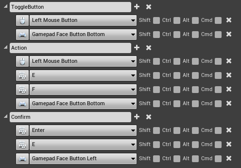

# Input

## **Manually configure control**

### Action mappings

.png>)

### Axis mappings

.png>)

## **Import file with control settings**


Importing a file with control settings will overwrite the existing control.


You can also download a [file](https://drive.google.com/file/d/1jBR-bc-ZfNXKCve5a6LkDWtu54Aq__rw/view?usp=sharing) with management settings and import it to **Project Settings -> Input -> Import**

.png>)
